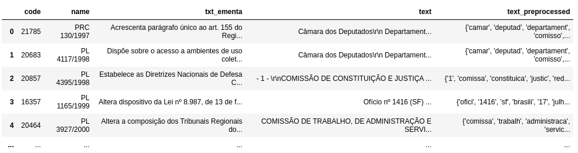

# BuscaDoc

Uma plataforma simples para a obtenção dados para o treinamento de modelos de recuperação de informação


## 1. Execução sem Docker

Na raíz do projeto, execute

```bash
pip3 install -r requirements.txt
```

para realizar a instalação dos requisitos.

### 1.1 Inicializando Banco

No diretório `./db` execute o comando 

```bash
docker-compose up -d
```

Para criar um container com o banco postgres.

Dentro do mesmo diretório, execute

```bash
bash load_schema.sh
```

ou, alternativamente, conecte-se ao banco com

```bash
bash connect.sh
```

e execute os *create tables* para as tabelas `corpus` e `feedback`.

Tendo uma arquivo *.csv* no seguinte formato:



como os arquivos `corpus_full.csv` e `corpus_small.csv`, estes podem ser inseridos diretamente no banco executando

```bash
bash connect.csv 
```

e, no postgres,

```postgres
\COPY corpus FROM 'nomedoarquivo' CSV HEADER DELIMITER ',';
```

Para parar a execução do banco, execute na mesma pasta

```bash
docker-compose down
```

### 1.2 lookForSimilar

Com o banco sendo executado e os requisitos instalados, podemos executar o `lookForSimilar`. No diretório de mesmo nome, executamos:

```bash
python3 app.py
```

para executarmos diretamente com o `Python 3` ou então

```bash
python3 wsgi.py
```

para executar usando o `WSGI`.

### 1.3 scoringApi

No diretório `scoringApi`, execute

```bash
python3 app.py
```

para executar diretamente ou então

```bash
bash autorun
```


### 1.4 frontend

No diretório `frontend`, execute

```bash
python3 app.py
```

para executar diretamente ou então

```bash
bash autorun
```

# 3. Modo Uso

Ao acessar o endereço `http://localhost:3000`, o usuário será apresentado à seguinte página:


