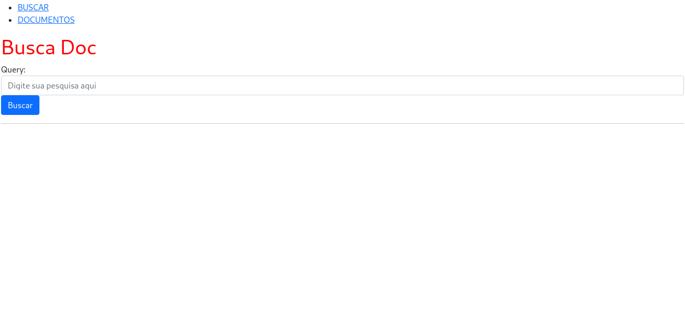
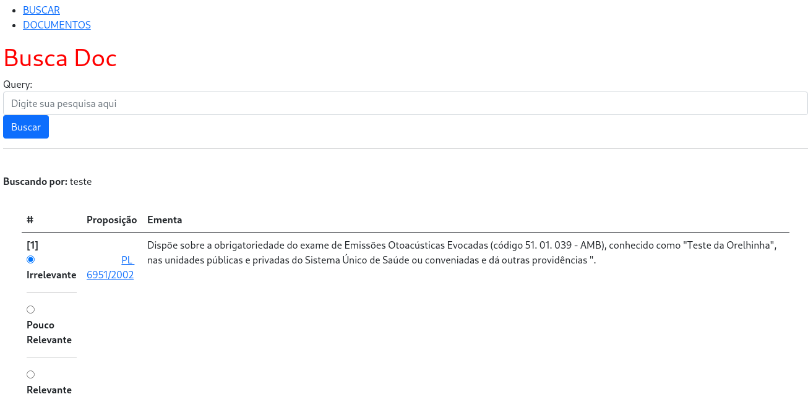
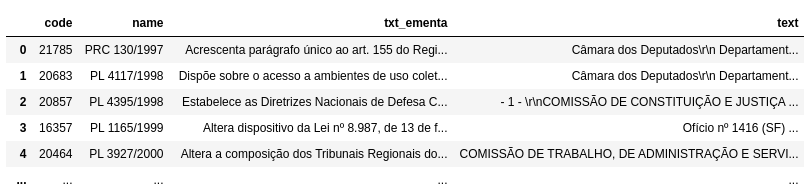

# BuscaDoc

Uma plataforma simples para a obtenção dados para o treinamento de modelos de recuperação de informação


| Arquivo          | Link                                                                                           | Descrição                                    |
|------------------|------------------------------------------------------------------------------------------------|----------------------------------------------|
| corpus_small.csv | [download](https://drive.google.com/file/d/1TwrKqLzcUe_mZX18zQvxtDyiysIryDDQ/view?usp=sharing) | Contém 5000 documentos do corpus original.   |
| corpus_full.csv  | [download](https://drive.google.com/file/d/1CcnIwmM_ydDxURkrGqVM2onEKOCNcTtq/view?usp=sharing) | Corpus original, contendo 114646 documentos. |
| arvore-proposicoes.csv     | [download](https://drive.google.com/file/d/1WTvXoAWM-FuJIve-Pk0JED_2aNDAXMOC/view?usp=sharing)   | Árvore de proposições da Câmara dos Deputados.     |
| new_docs.csv     | [download](https://drive.google.com/file/d/1AiIjlbTahhidRPlp7nB4dhebpgHFM2SD/view?usp=sharing)   | Arquivos para testar inserção na página.     |


## 1. Execução

<a name="1_1"></a>
### 1.1 Inicializando Banco

Faça o download dos arquivos `arvore-proposicao.csv`,`solicitacoes.csv` e algum dos arquivos de *Corpus* `corpus_small.csv` ou `corpus_full.csv`. Renomeie o último para `corpus.csv` e mova todos os arquivos *csv* para dentro da pasta `./DB`

Dentro do diretório `./DB`, execute o comando 

```bash
docker-compose up -d
```
 
Para executar o container com o banco de dados e inicializá-lo.

É possível se conectar ao banco executando

```bash
bash connect.sh 
```

### 1.2 Microsserviços

Estando em execução o banco de acordo com [1.1](#1_1), dentro do diretório `./Microservices` execute:

```bash
docker-compose up -d
```

Com isso, os microsserviços serão executados nas portas *5000-5004*.

### 1.3 Frontend

No diretório `./Frontend`, execute

```bash
docker-compose up -d
```

Para executar a página *BuscaDoc*.


# 2. Modo Uso

Ao acessar o endereço `http://localhost:3000`, o usuário será apresentado à seguinte página:



Ao fazer uma busca, os resultados mais relevantes para ela de acordo com o modelo serão mostradas e sua relevância poderá ser classificada pelo usuário.



Ao terminar de classificar os resultados, o usuário deve clicar em "enviar" no fim da página.

Na aba **DOCUMENTOS**, o usuário pode inserir arquivos do tipo *csv* no seguinte formato:



de acordo com o arquivo de exemplo `new_docs.csv`. Os campos são:

- **code**: O código do arquivo de acordo como site da Câmara.
- **name**: O nome do arquivo
- **txt_ementa**: A ementa
- **text**: O texto completo (equivalente à *imgArquivoTeorPDF* nas bases da Câmara)


# 3. Microsserviços

## 3.1 look-for-similar

Recebendo uma query do usuário e argumentos de opção de saída, retorna as $k$ *PL*s e *Solicitações de Trabalho* mais relacionadas à ela.  

Executado na porta *5000*.

Entrada:

```json
{
    "text": <query>,
    "num_proposicoes": <k proposições à serem retornadas>,
    "expansao": <1 para realizar expansão de query, 0 para não realizar>,
    "improve-similarity": <1 para utilização do improve-similarity, 0 para não utilizar>
}
```

Saída:

```json
{
    "proposicoes": [
        {
            "id": <codigo da proposicao>,
            "name": "PL xxx/xxxx",
            "texto": <ementa>,
            "score": <score do modelo>,
            "tipo": "PR",
            "arvore": [
                {
                    "numero_sequencia": <numero_sequencia>,
                    "nivel": <nivel>,
                    "cod_proposicao": <cod_proposicao>,
                    "cod_proposicao_referenciada": <cod_proposicao_referenciada>,
                    "cod_proposicao_raiz": <cod_proposicao_raiz>,
                    "tipo_referencia": <tipo_referencia>
                },
                {...}
            ]
        },
        {...}
    ],
    "solicitacoes": [
        {
            "name": "PL xxx/xxxx",
            "texto": <solicitação de tabalho>,
            "score": <score do modelo>,
            "tipo": "ST"
        },
        {...}
    ]
}
```

## 3.2 save-relevance-feedback

Serviço auxiliar para *improve-similarity* e avaliação do modelo. Recebe feedback do usuário sobre o retorno do modelo para dada query.

Executado na porta *5001*.

Entrada:

```json
{
    "query": <query>,
    "results": [
        {
            "id": <codigo da proposicao ou solicitação de trabalho>,
            "class": <classificação de relevância pelo usuário>,
            "score": <score dado pelo modelo>,
            "tipo": <'PR' ou 'ST'>
        },
        {...}
    ],
    "extra_results": ["PL XXXX/XXXX", "PDC XXXX/XXXX", "PEC XX/XXXX",  (...)]
}
```

Dada uma request válida, os dados serão cadastrados na tabela *feedback* no banco.

## 3.3 look-for-referenced

Recebe um texto de entrada e retora as entidades (como por exemplo *PL*s, Leis e apelidos de lei referenciados) presentes nele

Executado na porta *5002*.

Entrada:

```json
{
    "text": <texto de entrada>
}
```

Saída:

```json
{
    "entities": [
        ("PL xxx/xxxx", <score>),
        ("Projeto de lei xxx de 20xx", <score>),
        ("Lei número xxxxx", <score>),
        ("CLT", <score>),
        (...)
    ]
}
```

## 3.4 expand-query

Dado uma query de entrada, utiliza as entidades recuperadas pelo microsserviço **look-for-referenced** para expandi-la usando as ementas de *PL*s ou solicitações de trabalho citadas.

Executado na porta *5003*.

Entrada:

```json
{
    "query": <query>
}
```

Saída:

```json
{
    "query": <query expandida>,
    "entities": [
        ("PL xxx/xxxx", <score>),
        ("Projeto de lei xxx de 20xx", <score>),
        ("Lei número xxxxx", <score>),
        ("CLT", <score>),
        (...)
    ]
}
```